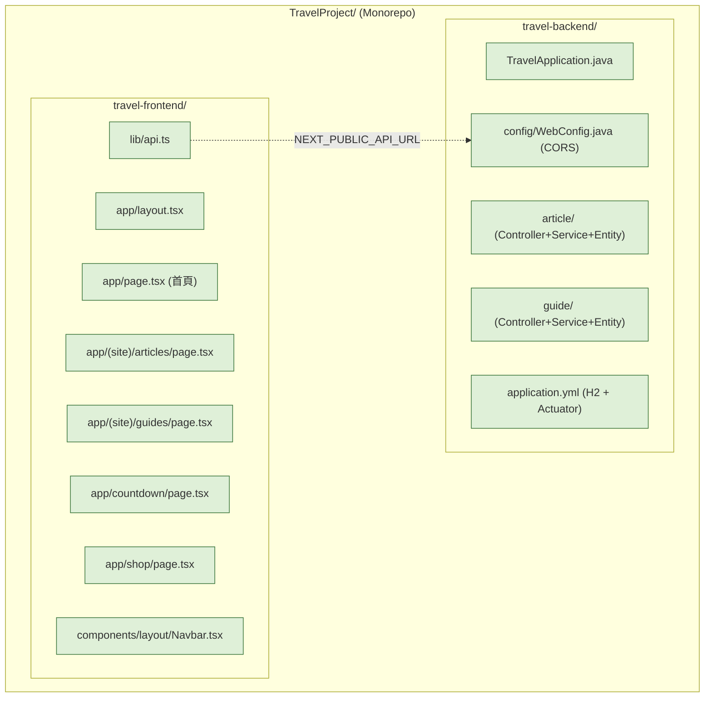

# Plan: Phase 1 — 前後端專案 Scaffold 初始化

**建立日期：** 2026-06-28
**對應 spec：** `/spec/20260628-01-init.md`
**執行範圍：** Phase 1 only（scaffold，不含功能實作）

---

## Goal

為 Travel Project 建立前後端分離的基礎專案骨架，採 Monorepo 方式共用同一個 git repo。

- **前端** (`travel-frontend/`)：Next.js 15 App Router + TypeScript + Tailwind CSS，含完整 route 結構與 component 目錄
- **後端** (`travel-backend/`)：Spring Boot 3 + Java 21 + Maven + H2 In-Memory DB，含模組化 package 結構與 CORS 設定

完成標準：前端 `http://localhost:3000` 顯示首頁、後端 `http://localhost:8080/actuator/health` 回傳 `{"status":"UP"}`。功能邏輯留給 Phase 2+。

---

## Architecture / Flow



---

## Scope

### May modify / create（Phase 1 全部新建）

**前端 `travel-frontend/`**

```
travel-frontend/
├── app/
│   ├── layout.tsx              # Root layout（字型、metadata）
│   ├── page.tsx                # 首頁 placeholder
│   ├── globals.css
│   ├── (site)/
│   │   ├── articles/page.tsx   # placeholder
│   │   └── guides/page.tsx     # placeholder
│   ├── countdown/page.tsx      # placeholder
│   └── shop/page.tsx           # placeholder
├── components/
│   ├── layout/
│   │   ├── Navbar.tsx          # 導覽列（靜態連結）
│   │   └── Footer.tsx
│   └── ui/                     # 空目錄，Phase 2+ 使用
├── lib/
│   └── api.ts                  # fetch wrapper（讀 NEXT_PUBLIC_API_URL）
├── types/
│   └── index.ts                # 全域型別（空 export）
├── .env.local.example
├── next.config.ts
├── tailwind.config.ts
├── tsconfig.json
└── package.json
```

**前端 dependencies：**

| 套件 | 用途 |
|------|------|
| `next@15` | 框架 |
| `react@19` | UI |
| `typescript` | 語言 |
| `tailwindcss@4` | 樣式 |
| `framer-motion` | 動畫（Phase 2 用，先裝） |
| `date-fns` | 日期計算（Phase 2 用，先裝） |
| `clsx` | className 工具 |

---

**後端 `travel-backend/`**

```
travel-backend/
├── src/main/java/com/travel/
│   ├── TravelApplication.java
│   ├── config/
│   │   └── WebConfig.java          # CORS 允許 localhost:3000
│   ├── article/
│   │   ├── Article.java            # @Entity placeholder
│   │   ├── ArticleService.java     # @Service placeholder
│   │   └── ArticleController.java  # @RestController placeholder
│   ├── guide/
│   │   ├── Guide.java
│   │   ├── GuideService.java
│   │   └── GuideController.java
│   ├── countdown/                  # 空目錄（Phase 1 無 API）
│   └── shop/                       # 空目錄（Phase 5）
├── src/main/resources/
│   └── application.yml             # H2 + Actuator + JPA
├── src/test/java/com/travel/
│   └── TravelApplicationTests.java
└── pom.xml
```

**後端 Maven dependencies：**

| 套件 | 用途 |
|------|------|
| `spring-boot-starter-web` | REST API |
| `spring-boot-starter-data-jpa` | ORM |
| `spring-boot-starter-actuator` | Health check |
| `spring-boot-starter-validation` | Bean Validation |
| `h2` (runtime) | In-Memory DB（Phase 1） |
| `lombok` | Boilerplate 減少 |
| `spring-boot-devtools` | 熱重載 |

### Must not modify
- `spec/` — 規格文件唯讀
- `plan/` — 本 plan 文件執行期間不修改

---

## Existing patterns to follow

全新專案，無現有 pattern。本次 scaffold 建立的結構將成為 Phase 2+ 的參考基準：

- 前端 route：`app/(site)/articles/page.tsx` 的 route group 格式
- 後端 module：`article/` 的三層結構（Entity / Service / Controller）

---

## Constraints

- Java 21（Spring Boot 3 LTS，符合穩定性要求）
- H2 In-Memory（Phase 1 不需要真實 DB，Phase 3 前換 PostgreSQL）
- Monorepo：兩個資料夾共用 TravelProject 的 git repo
- CORS：後端必須允許 `http://localhost:3000`
- **不實作任何業務邏輯**，placeholder 只需讓 Spring context 成功 load
- `.env.local` 與 `application-local.yml` 加入 `.gitignore`

---

## Verification

1. **Happy path（前端）：** `npm run dev` 啟動，瀏覽 `http://localhost:3000` 顯示首頁內容，導覽列四個連結均可點擊
2. **Happy path（後端）：** `./mvnw spring-boot:run` 啟動，`GET http://localhost:8080/actuator/health` 回傳 `{"status":"UP"}`
3. **TypeScript 型別檢查：** `npx tsc --noEmit` 回傳 0 errors

---

## Done definition

- [ ] `travel-frontend/` 可 `npm run dev` 啟動，首頁顯示正常
- [ ] 四個 route placeholder 可訪問：`/`、`/articles`、`/guides`、`/countdown`
- [ ] `npx tsc --noEmit` 0 errors
- [ ] `travel-backend/` 可 `./mvnw spring-boot:run` 啟動
- [ ] `GET /actuator/health` 回傳 `{"status":"UP"}`
- [ ] `WebConfig.java` CORS 允許 `http://localhost:3000`
- [ ] `.env.local` 與敏感設定已加入 `.gitignore`

---

## Risks & rollback

| 風險 | 說明 | 因應 |
|------|------|------|
| Spring Initializr 網路問題 | curl 無法連線 start.spring.io | 手動建立 Maven 結構 + pom.xml |
| Node 版本不足 | Next.js 15 需要 Node 20+ | `node -v` 確認，用 nvm 切換 |
| H2 Console 安全問題 | 預設 Spring Security 會擋 H2 console | `application.yml` 停用 security 或設定 permit |
| Tailwind v4 設定格式不同 | v4 改用 CSS-first 設定，無 `tailwind.config.js` | 依 v4 官方格式配置 |

**Rollback：** Phase 1 全為新建資料夾，直接 `rm -rf travel-frontend travel-backend` 即可還原，不影響 spec/ 與 plan/。

---

## Open questions

- 已確認：Java 21、H2 In-Memory、Monorepo
- [ ] Phase 3 前確認 DB 改 PostgreSQL 或 MySQL
- [ ] 部署平台確認（Vercel for FE、AWS/GCP for BE）

---

## 執行步驟摘要（給下一個對話使用）

```
Execute the plan in plan/20260628-01-init.md.
Do not deviate from the scope.
Stop and ask if you find ambiguity.

Key decisions already made:
- Java 21 (not 25)
- H2 In-Memory for Phase 1
- Monorepo under TravelProject/
```
